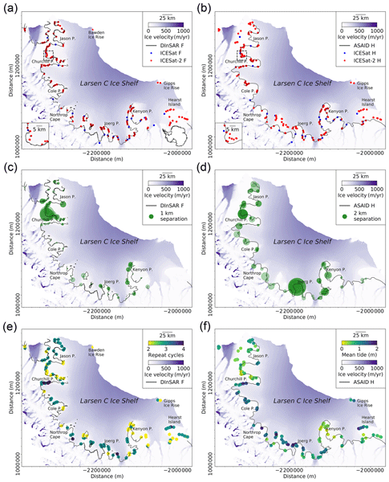

We present a new, fully automated method of mapping the Antarctic Ice Sheet’s grounding zone using a repeat-track analysis and crossover analysis of newly acquired ICESat-2 laser altimeter data. We map the position of the landward limit of tidal flexure and the inshore limit of hydrostatic equilibrium, as demonstrated over the mountainous and hitherto difficult to survey grounding zone of Larsen C Ice Shelf. Since the start of data acquisition in 2018, our method has already achieved a near 9-fold increase in the number of grounding zone observations compared with ICESat, which operated between 2003 and 2009. We have improved coverage in particular over the previously poorly mapped the Bawden and Gipps ice rises and Hearst Island. Acting as a reliable proxy for the grounding line, which cannot be directly imaged by satellites, our ICESat-2-derived landward limit of tidal flexure locations agrees well with independently obtained measurements, with a mean absolute difference and standard deviation of 0.39 and 0.32 km, respectively, compared to interferometric synthetic-aperture-radar-based observations. 

Our results demonstrate the efficiency, density, and high spatial accuracy with which ICESat-2 can image complex grounding zones and its clear potential for future mapping of the pan-ice sheet grounding zone.

Figure: Spatial distributions of ICESat-2-derived GZ features.

**Citation:**

**Tian Li**\*, Geoffrey Dawson, Stephen Chuter, Jonathan Bamber. 2020. [Mapping the grounding zone of Larsen C Ice Shelf, Antarctica, from ICESat-2 laser altimetry](https://tc.copernicus.org/articles/14/3629/2020/). ***The Cryosphere***, 14(11), 3629-3643.
